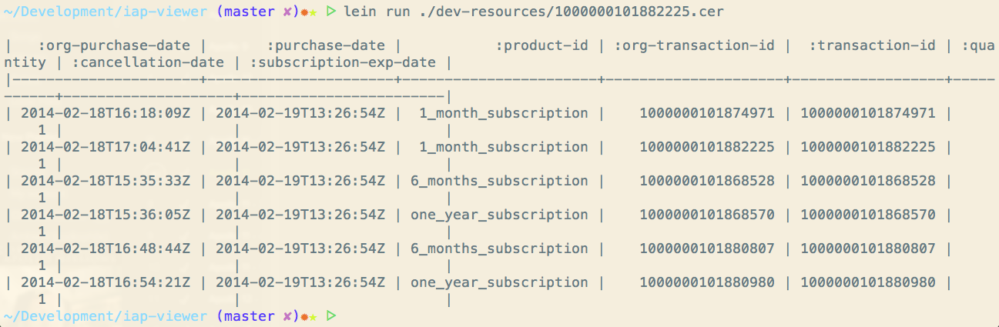

# iap-viewer

_work in progress_

A simple utility to dump (still no verification) the content of an In-App purchase receipt from Apple store backend.

You can run it as a web application

Or you can run at command line

## Prerequisites

You will need [Leiningen][1] 1.7.0 or above installed.

For the webapp, you will need [Bower][2] to install the needed scripts and stylesheets.

[1]: https://github.com/technomancy/leiningen
[2]: http://bower.io

## Running

To start a web server for the application, run:

    ./install_deps.sh
    lein ring server

Or you can simply use the tool as command line utility like this:

    lein run <<your der encoded file>>

## License

Copyright © 2014  Stefano S
